# Diagrama de Esquemas de Base de Datos

## 📊 Resumen de Esquemas Utilizados

El sistema utiliza **2 esquemas principales** en PostgreSQL:

1. **`mantenimiento`** - Esquema principal para gestión de personal y documentos
2. **`servicios`** - Esquema para gestión de carteras, clientes y nodos

---

## 🏗️ Diagrama de Esquemas

```mermaid
erDiagram
    %% ESQUEMA MANTENIMIENTO
    mantenimiento.personal_disponible {
        string rut PK
        string nombres
        string apellidos
        string cargo
        string correo_electronico
        string telefono
        timestamp created_at
        timestamp updated_at
    }
    
    mantenimiento.documentos {
        int id PK
        string rut_persona FK
        string nombre_archivo
        string ruta_archivo
        string tipo_documento
        date fecha_vencimiento
        int dias_restantes
        timestamp created_at
        timestamp updated_at
    }
    
    mantenimiento.estados {
        int id PK
        string nombre
        string descripcion
        boolean activo
        timestamp created_at
    }
    
    mantenimiento.personal_estados {
        int id PK
        string rut FK
        int estado_id FK
        date fecha_inicio
        date fecha_fin
        string observaciones
        timestamp created_at
    }
    
    mantenimiento.personal_carteras {
        int id PK
        string rut FK
        int cartera_id FK
        timestamp created_at
    }
    
    mantenimiento.personal_clientes {
        int id PK
        string rut FK
        int cliente_id FK
        timestamp created_at
    }
    
    mantenimiento.personal_nodos {
        int id PK
        string rut FK
        int nodo_id FK
        timestamp created_at
    }
    
    mantenimiento.prerrequisitos_clientes {
        int id PK
        int cliente_id FK
        string tipo_documento
        string descripcion
        boolean obligatorio
        timestamp created_at
    }
    
    mantenimiento.programacion_semanal {
        int id PK
        string rut FK
        int cartera_id FK
        int cliente_id FK
        int nodo_id FK
        date semana_inicio
        date semana_fin
        string observaciones
        timestamp created_at
        timestamp updated_at
    }
    
    mantenimiento.carteras {
        int id PK
        string codigo
        string nombre
        boolean activo
        timestamp created_at
    }
    
    mantenimiento.ingenieria_servicios {
        int id PK
        string rut FK
        string nombres
        string apellidos
        string especialidad
        boolean activo
        timestamp created_at
    }
    
    mantenimiento.nodos {
        int id PK
        string nombre
        string ubicacion
        int cartera_id FK
        boolean activo
        timestamp created_at
    }
    
    mantenimiento.servicios_programados {
        int id PK
        int cartera_id FK
        int nodo_id FK
        int ingeniero_id FK
        date fecha_proximo_servicio
        string estado
        string observaciones
        boolean activo
        timestamp created_at
    }
    
    %% ESQUEMA SERVICIOS
    servicios.carteras {
        int id PK
        string name
        timestamp created_at
        timestamp updated_at
    }
    
    servicios.clientes {
        int id PK
        int cartera_id FK
        string nombre
        string direccion
        string telefono
        string email
        boolean activo
        timestamp created_at
        timestamp updated_at
    }
    
    servicios.nodos {
        int id PK
        int cliente_id FK
        string nombre
        string ubicacion
        string tipo
        boolean activo
        timestamp created_at
        timestamp updated_at
    }
    
    servicios.acuerdos {
        int id PK
        int cartera_id FK
        int cliente_id FK
        int nodo_id FK
        string tipo_acuerdo
        string descripcion
        date fecha_inicio
        date fecha_fin
        decimal monto
        string estado
        timestamp created_at
        timestamp updated_at
    }
    
    servicios.minimo_personal {
        int id PK
        int cartera_id FK
        int cliente_id FK
        int nodo_id FK
        int cantidad_minima
        string tipo_personal
        string observaciones
        timestamp created_at
        timestamp updated_at
    }
    
    %% RELACIONES ENTRE ESQUEMAS
    mantenimiento.personal_disponible ||--o{ mantenimiento.documentos : "tiene"
    mantenimiento.personal_disponible ||--o{ mantenimiento.personal_estados : "tiene"
    mantenimiento.personal_disponible ||--o{ mantenimiento.personal_carteras : "asignado_a"
    mantenimiento.personal_disponible ||--o{ mantenimiento.personal_clientes : "asignado_a"
    mantenimiento.personal_disponible ||--o{ mantenimiento.personal_nodos : "asignado_a"
    mantenimiento.personal_disponible ||--o{ mantenimiento.programacion_semanal : "programado_en"
    mantenimiento.personal_disponible ||--o{ mantenimiento.ingenieria_servicios : "es_ingeniero"
    
    mantenimiento.estados ||--o{ mantenimiento.personal_estados : "define"
    
    servicios.carteras ||--o{ servicios.clientes : "contiene"
    servicios.carteras ||--o{ servicios.acuerdos : "tiene"
    servicios.carteras ||--o{ servicios.minimo_personal : "requiere"
    servicios.carteras ||--o{ mantenimiento.personal_carteras : "asignado_a"
    servicios.carteras ||--o{ mantenimiento.programacion_semanal : "programado_en"
    
    servicios.clientes ||--o{ servicios.nodos : "tiene"
    servicios.clientes ||--o{ servicios.acuerdos : "tiene"
    servicios.clientes ||--o{ servicios.minimo_personal : "requiere"
    servicios.clientes ||--o{ mantenimiento.personal_clientes : "asignado_a"
    servicios.clientes ||--o{ mantenimiento.programacion_semanal : "programado_en"
    servicios.clientes ||--o{ mantenimiento.prerrequisitos_clientes : "requiere"
    
    servicios.nodos ||--o{ servicios.acuerdos : "tiene"
    servicios.nodos ||--o{ servicios.minimo_personal : "requiere"
    servicios.nodos ||--o{ mantenimiento.personal_nodos : "asignado_a"
    servicios.nodos ||--o{ mantenimiento.programacion_semanal : "programado_en"
    
    mantenimiento.carteras ||--o{ mantenimiento.nodos : "contiene"
    mantenimiento.carteras ||--o{ mantenimiento.servicios_programados : "tiene"
    
    mantenimiento.ingenieria_servicios ||--o{ mantenimiento.servicios_programados : "asignado_a"
    mantenimiento.nodos ||--o{ mantenimiento.servicios_programados : "servicio_en"
```

---

## 📋 Descripción de Esquemas

### 🔧 **Esquema `mantenimiento`**

**Propósito**: Gestión de personal, documentos y estados del sistema.

#### **Tablas Principales:**

1. **`personal_disponible`** - Información del personal
   - RUT, nombres, cargo, contacto
   - Tabla central del sistema

2. **`documentos`** - Documentos del personal
   - Archivos, fechas de vencimiento, tipos
   - Vinculados por RUT

3. **`estados`** - Estados del personal
   - Activo, inactivo, vacaciones, etc.

4. **`personal_estados`** - Historial de estados
   - Fechas de inicio/fin de estados

5. **`personal_carteras`** - Asignaciones a carteras
6. **`personal_clientes`** - Asignaciones a clientes
7. **`personal_nodos`** - Asignaciones a nodos

8. **`prerrequisitos_clientes`** - Requisitos por cliente
9. **`programacion_semanal`** - Programación de trabajo

#### **Tablas del Sistema Antiguo:**
- `carteras`, `ingenieria_servicios`, `nodos`, `servicios_programados`

---

### 🏢 **Esquema `servicios`**

**Propósito**: Gestión de carteras, clientes y nodos del negocio.

#### **Tablas Principales:**

1. **`carteras`** - Carteras de clientes
   - COSTA - PUERTO, BAKERY - CARNES, INDUSTRIA, etc.

2. **`clientes`** - Clientes por cartera
   - Información de contacto y ubicación

3. **`nodos`** - Nodos por cliente
   - Ubicaciones específicas de servicios

4. **`acuerdos`** - Acuerdos comerciales
   - Contratos, montos, fechas

5. **`minimo_personal`** - Requerimientos mínimos
   - Personal mínimo por cartera/cliente/nodo

---

## 🔗 **Relaciones Entre Esquemas**

### **Conexiones Principales:**

1. **Personal ↔ Servicios**
   - `mantenimiento.personal_disponible` ↔ `servicios.carteras/clientes/nodos`
   - A través de tablas de asignación

2. **Programación**
   - `mantenimiento.programacion_semanal` conecta ambos esquemas
   - Vincula personal con carteras/clientes/nodos

3. **Documentos**
   - `mantenimiento.documentos` vinculados por RUT
   - Independientes del esquema servicios

---

## 📊 **Estadísticas de Uso**

### **Esquema `mantenimiento`:**
- **12 tablas** principales
- **Tabla central**: `personal_disponible`
- **Funcionalidad**: Gestión de personal y documentos

### **Esquema `servicios`:**
- **5 tablas** principales
- **Tabla central**: `carteras`
- **Funcionalidad**: Gestión comercial y operacional

### **Tablas de Conexión:**
- **3 tablas** de asignación personal
- **1 tabla** de programación semanal
- **1 tabla** de prerrequisitos

---

## 🚀 **Endpoints por Esquema**

### **Endpoints `mantenimiento`:**
- `/api/personal` - Gestión de personal
- `/api/documentos` - Gestión de documentos
- `/api/estados` - Gestión de estados
- `/api/asignaciones` - Asignaciones de personal
- `/api/programacion` - Programación semanal
- `/api/carpetas-personal` - Sistema de carpetas

### **Endpoints `servicios`:**
- `/api/servicios/carteras` - Gestión de carteras
- `/api/servicios/clientes` - Gestión de clientes
- `/api/servicios/nodos` - Gestión de nodos
- `/api/acuerdos` - Gestión de acuerdos
- `/api/minimo-personal` - Requerimientos mínimos

---

## 📝 **Notas Importantes**

1. **Migración**: El sistema migró de `mantenimiento` a `servicios` para carteras/clientes/nodos
2. **Compatibilidad**: Se mantienen ambas estructuras para compatibilidad
3. **Personal**: Siempre en esquema `mantenimiento`
4. **Documentos**: Vinculados por RUT, independientes de esquema servicios
5. **Programación**: Conecta ambos esquemas para funcionalidad completa

---

*Diagrama generado el 15 de octubre de 2025*
