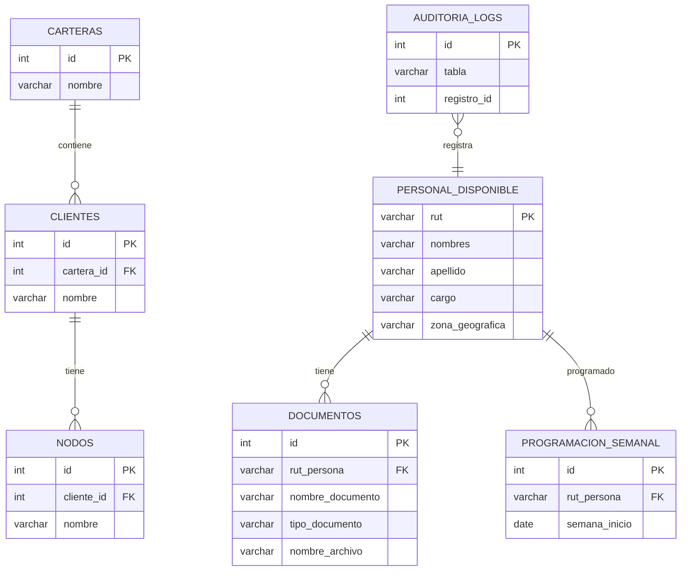

# Diagrama gráfico de la base de datos (Mermaid)

Pegado aquí un diagrama Mermaid ER que muestra las relaciones principales. Puedes abrir este archivo en un visor que soporte Mermaid (o en GitHub si está habilitado).

Instrucciones: si quieres un diagrama más completo (columnas, tipos, constraints), puedo generar un script SQL que extraiga el esquema real desde la base de datos y crear el diagrama automáticamente.
