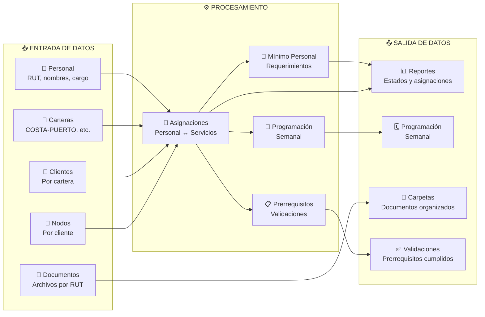
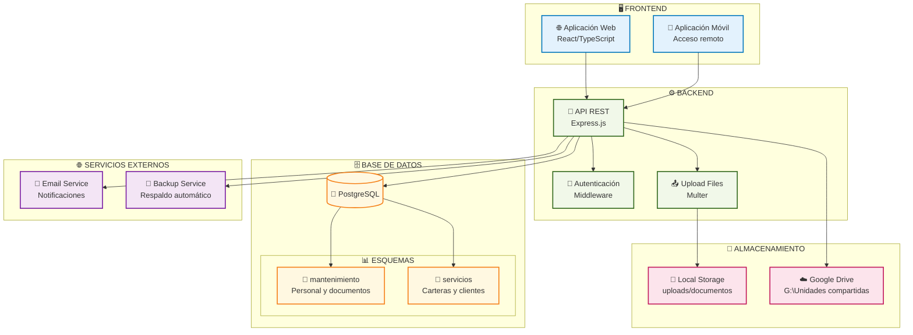
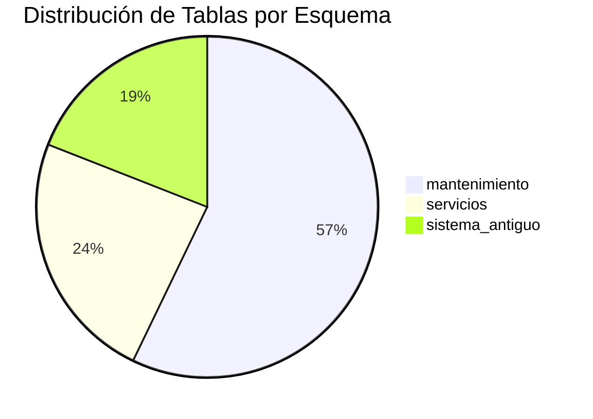
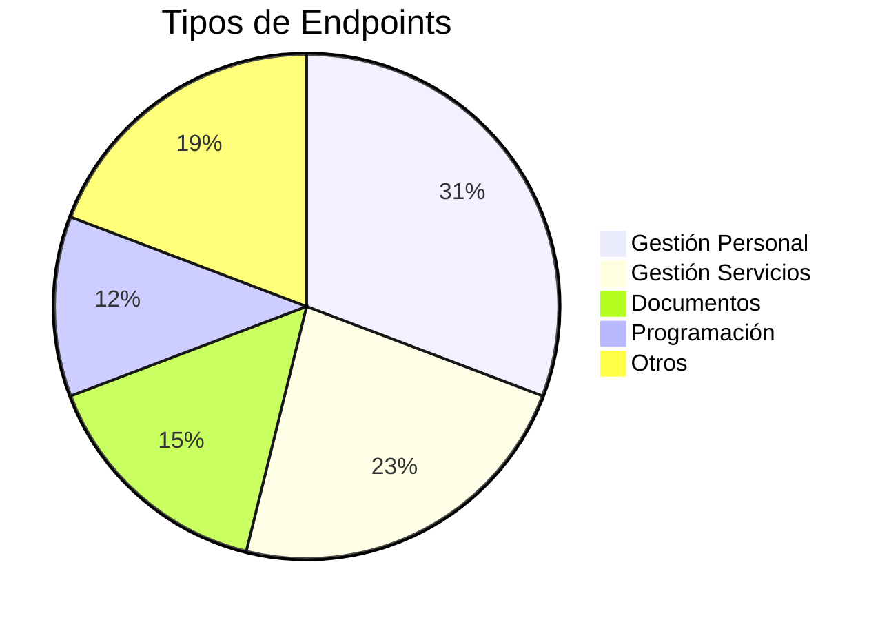
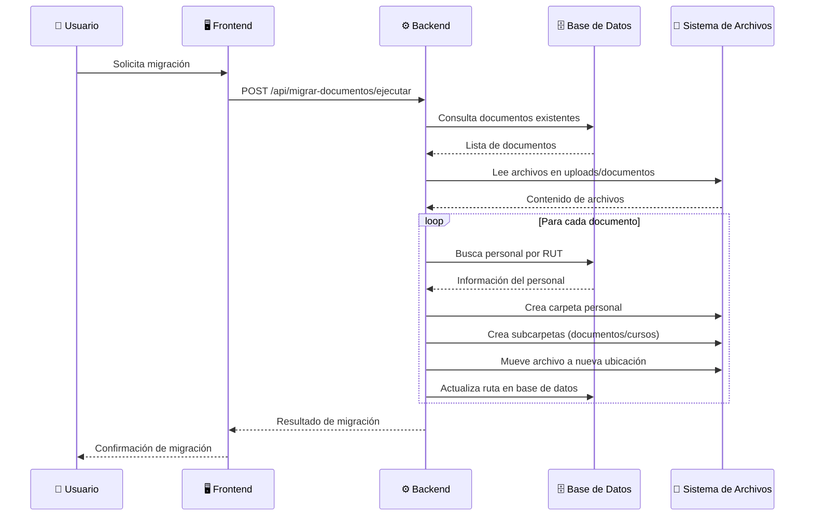

# Diagrama Gráfico de Esquemas de Base de Datos

## 🎨 Vista Gráfica del Sistema

```mermaid
graph TB
    %% ESQUEMA MANTENIMIENTO
    subgraph MANTENIMIENTO["🔧 ESQUEMA MANTENIMIENTO"]
        direction TB
        
        subgraph PERSONAL["👥 GESTIÓN DE PERSONAL"]
            PD[personal_disponible<br/>📋 RUT, nombres, cargo]
            PE[personal_estados<br/>📊 Estados del personal]
            EST[estados<br/>🏷️ Tipos de estados]
        end
        
        subgraph DOCUMENTOS["📄 GESTIÓN DE DOCUMENTOS"]
            DOC[documentos<br/>📁 Archivos por RUT]
        end
        
        subgraph ASIGNACIONES["🔗 ASIGNACIONES"]
            PC[personal_carteras<br/>🏢 Asignación a carteras]
            PCLI[personal_clientes<br/>🏪 Asignación a clientes]
            PN[personal_nodos<br/>📍 Asignación a nodos]
        end
        
        subgraph PROGRAMACION["📅 PROGRAMACIÓN"]
            PS[programacion_semanal<br/>🗓️ Programación semanal]
        end
        
        subgraph PRERREQUISITOS["📋 PRERREQUISITOS"]
            PRC[prerrequisitos_clientes<br/>✅ Requisitos por cliente]
        end
        
        subgraph SISTEMA_ANTIGUO["🔄 SISTEMA ANTIGUO"]
            CAR_OLD[carteras<br/>🏢 Carteras antiguas]
            IS[ingenieria_servicios<br/>👨‍💼 Ingenieros]
            NOD_OLD[nodos<br/>📍 Nodos antiguos]
            SP[servicios_programados<br/>⚙️ Servicios programados]
        end
    end
    
    %% ESQUEMA SERVICIOS
    subgraph SERVICIOS["🏢 ESQUEMA SERVICIOS"]
        direction TB
        
        subgraph CARTERAS["💼 CARTERAS"]
            CAR[carteras<br/>🏢 COSTA-PUERTO, BAKERY-CARNES, etc.]
        end
        
        subgraph CLIENTES["🏪 CLIENTES"]
            CLI[clientes<br/>👥 Clientes por cartera]
        end
        
        subgraph NODOS["📍 NODOS"]
            NOD[nodos<br/>📍 Ubicaciones por cliente]
        end
        
        subgraph ACUERDOS["📋 ACUERDOS"]
            ACU[acuerdos<br/>📄 Contratos comerciales]
        end
        
        subgraph MINIMO["👥 MÍNIMO PERSONAL"]
            MP[minimo_personal<br/>📊 Requerimientos mínimos]
        end
    end
    
    %% CONEXIONES PRINCIPALES
    PD -->|"RUT"| DOC
    PD -->|"RUT"| PE
    PD -->|"RUT"| PC
    PD -->|"RUT"| PCLI
    PD -->|"RUT"| PN
    PD -->|"RUT"| PS
    PD -->|"RUT"| IS
    
    EST -->|"estado_id"| PE
    
    %% CONEXIONES ENTRE ESQUEMAS
    CAR -->|"cartera_id"| CLI
    CLI -->|"cliente_id"| NOD
    CLI -->|"cliente_id"| ACU
    CLI -->|"cliente_id"| MP
    CLI -->|"cliente_id"| PRC
    
    CAR -->|"cartera_id"| ACU
    CAR -->|"cartera_id"| MP
    CAR -->|"cartera_id"| PC
    CAR -->|"cartera_id"| PS
    
    NOD -->|"nodo_id"| ACU
    NOD -->|"nodo_id"| MP
    NOD -->|"nodo_id"| PN
    NOD -->|"nodo_id"| PS
    
    %% CONEXIONES SISTEMA ANTIGUO
    CAR_OLD -->|"cartera_id"| NOD_OLD
    CAR_OLD -->|"cartera_id"| SP
    IS -->|"ingeniero_id"| SP
    NOD_OLD -->|"nodo_id"| SP
    
    %% ESTILOS
    classDef mantenimiento fill:#e1f5fe,stroke:#01579b,stroke-width:2px
    classDef servicios fill:#f3e5f5,stroke:#4a148c,stroke-width:2px
    classDef personal fill:#e8f5e8,stroke:#1b5e20,stroke-width:2px
    classDef documentos fill:#fff3e0,stroke:#e65100,stroke-width:2px
    classDef asignaciones fill:#fce4ec,stroke:#880e4f,stroke-width:2px
    classDef programacion fill:#e0f2f1,stroke:#004d40,stroke-width:2px
    classDef antiguo fill:#f5f5f5,stroke:#424242,stroke-width:2px
    
    class PD,PE,EST personal
    class DOC documentos
    class PC,PCLI,PN,PRC asignaciones
    class PS programacion
    class CAR_OLD,IS,NOD_OLD,SP antiguo
    class CAR,CLI,NOD,ACU,MP servicios
```

---

## 🎯 **Flujo de Datos Principal**

---

## 🏗️ **Arquitectura del Sistema**

---

## 📊 **Estadísticas Visuales**

---

## 🔄 **Flujo de Migración de Documentos**

---

## 📋 **Resumen Visual**

### **🎯 Características Principales:**
- **2 Esquemas** principales (mantenimiento + servicios)
- **21 Tablas** en total
- **26 Endpoints** API
- **Sistema híbrido** (local + Google Drive)
- **Migración automática** de documentos

### **🔗 Conexiones Clave:**
- Personal ↔ Servicios (asignaciones)
- Documentos ↔ Personal (por RUT)
- Programación ↔ Ambos esquemas
- Carpetas ↔ Google Drive

### **📊 Funcionalidades:**
- ✅ Gestión completa de personal
- ✅ Sistema de documentos organizados
- ✅ Programación semanal
- ✅ Validación de prerrequisitos
- ✅ Asignaciones flexibles
- ✅ Migración automática

---

*Diagramas generados el 15 de octubre de 2025*
